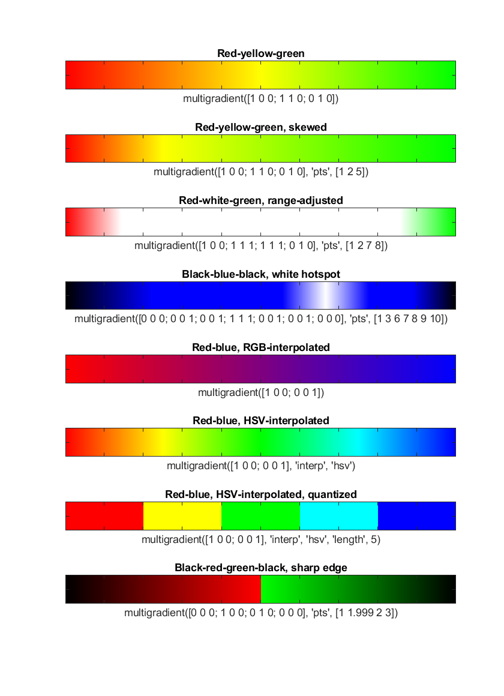

# multigradient: an adjustable multiple-colour gradient colour map for MATLAB

This script allows you to generate a colour scale (as for colormap, colorbar) using any number of custom colours, and allows you to arrange these colours by adjusting their relative positions with respect to each other, much like you may be used to creating gradients in e.g. Adobe Photoshop or CorelDRAW. It will automatically interpolate the colours in between the indicated anchor points.

In its most basic form, simply call the script using an n-by-3 matrix of RGB values, and it will generate the colour map accordingly. For example, `multigradient([1 0 0; 1 1 0; 0 1 0])` will return a map that blends from red through yellow to green, of the same size as the current figure's color map. Further tricks are optional.

* Interpolation in __RGB__ space. Simple linear interpolation of the given RGB values.
* Interpolation in __HSV__ space. Linear interpolation of the values after conversion into HSV, for e.g. the rainbow colormap: `multigradient([1 0 0; 0 0 1], 'interp', 'hsv')`.
* __Isoluminant__ interpolation in __L\*a\*b\*__ (Lab) space. The L* value is equalised for all given colours before linear interpolation and conversion back to RGB. Note that some colour clipping may occur due to gamut differences.
* Interpolation in Kenneth Moreland's __Msh__ space for __divergent colour maps for scientific visualisation__. A neutral unsatured middle point is automatically inserted if the two endpoint colours for the diverging map are sufficiently distinct. See [Moreland, K. (2009). Diverging color maps for scientific visualization. In *Proceedings of the 5th International Symposium on Visual Computing*. doi: 10.1007/978-3-642-10520-3_9](https://www.kennethmoreland.com/color-maps/ColorMapsExpanded.pdf).
* __Control points__ allow the relative positions of, and distances between the colours to be adjusted.
* Many __presets__, including colour scales designed by [Kenneth Moreland](https://www.kennethmoreland.com) and [Cynthia Brewer](http://colorbrewer2.org), are included.
* Colour scales can easily be __reversed__. 




## Sample usage

Starting with a figure ...

```
f = figure;
subplot(1,2,1); imagesc(sort(rand(50), 'descend')); colorbar;
subplot(1,2,2); surfc(peaks(250), 'EdgeColor', 'none'); colorbar;
axis vis3d; caxis([-max(abs(caxis)), max(abs(caxis))]);
set(f, 'Position', get(f, 'Position') .* [1 1 2 1]);
```

... we can change its color scale by calling `colormap` with an n-by-3 matrix of RGB colour values. `multigradient` returns such a list. We can thus call `colormap` with `multigradient` as argument inline.

To create a simple black-red-yellow-white colormap, we would put those four colours in that order as the first argument to `multigradient`:

```
rgb = [0 0 0; 1 0 0; 1 1 0; 1 1 1];
colormap(multigradient(rgb));
```

It is possible to change the relative location of the colours by adjusting the relative values of the color stops, or control points. One control point must be indicated for each given colour. (Exception: when two colours are given, three control points can be used, with the second one representing the middle of the colour scale.)

``` 
pts = [1 5 6 7];
colormap(multigradient(rgb, pts));
```

The relative positioning of the `pts` numbers on the number line reflect where the colours will end up in the colour map. The actual numbers used are irrelevant.


## Presets

A number of presets are available. For example, Kenneth Moreland suggests using the following diverging colour map for scientific visualisation:

```
colormap(multigradient('preset', 'div.km.BuRd'));
```

The naming convention is as follows: `type.source.colours.variation`, where: 
* `type` is either `seq` (sequential) or `div` (diverging); this script is not meant for qualitative colour maps.
* `source`, if applicable, signifies the source of the colour map, e.g. a person's initials or an organisation's abbreviation. This must be blank if no specific source can be identified.
* `colours` describe the colours used in the colour map. `BuRd` for example indicates a colour map where blue is mapped to low values, and red to high values. Use the following abbreviations:
  * `Bk` = Black
  * `Br` = Brown
  * `Bu` = Blue
  * `Gn` = Green
  * `Gy` = Grey
  * `Or` = Orange
  * `Pi` = Pink
  * `Pu` = Purple
  * `Rd` = Red
  * `Tn` = Tan
  * `Tq` = Turquoise
  * `Wh` = White
  * `Yl` = Yellow
* `variation` is an optional descriptor of the colour map, to be used to distinguish between two or more colour maps that would otherwise have the same name. For example, the `div.cb` maps come in different variations, characterised by the different number of colours used, and `div.GnRd.iso` is a generic green-red colour map, but of an isoluminant variation.

Control points can be applied to presets as well. See inside the script for all available presets.


