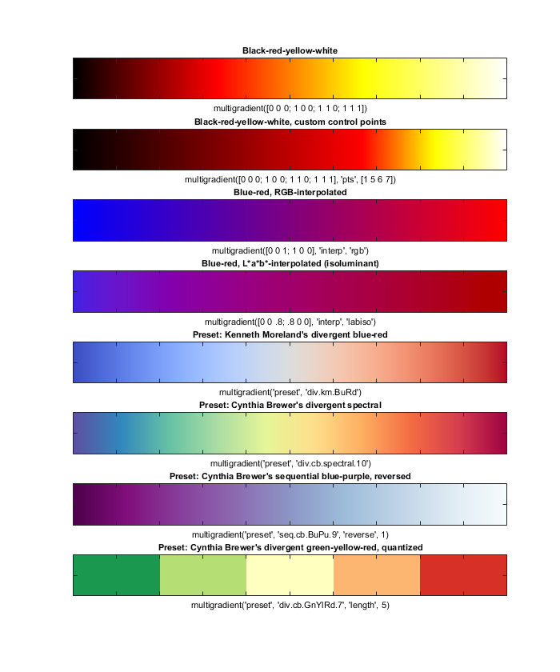

# multigradient: an adjustable multiple-colour gradient colour map for MATLAB

This script allows you to generate a colour scale (as for colormap, colorbar) using any number of custom colours, and allows you to arrange these colours by adjusting their relative positions with respect to each other, much like you may be used to creating gradients in e.g. Adobe Photoshop or CorelDRAW. It will automatically interpolate the colours in between the indicated anchor points. Interpolation can be done in both RGB and HSV space.

In its most basic form, simply call the script using an n-by-3 matrix of RGB values, and it will generate the colour map accordingly. For example, `multigradient([1 0 0; 1 1 0; 0 1 0])` will return a map that blends from red through yellow to green, of the same size of the current figure's color map. Further tricks are optional. 

